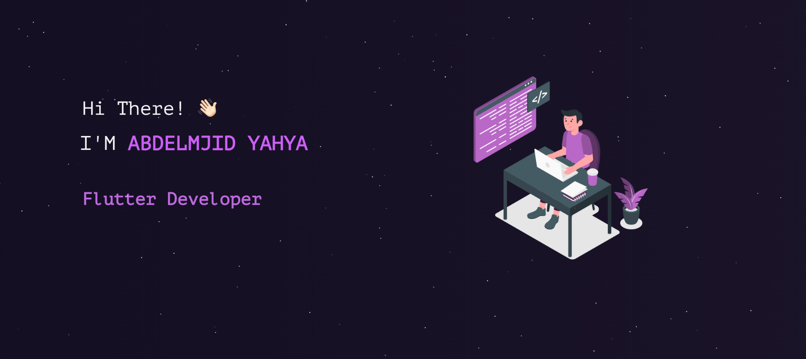
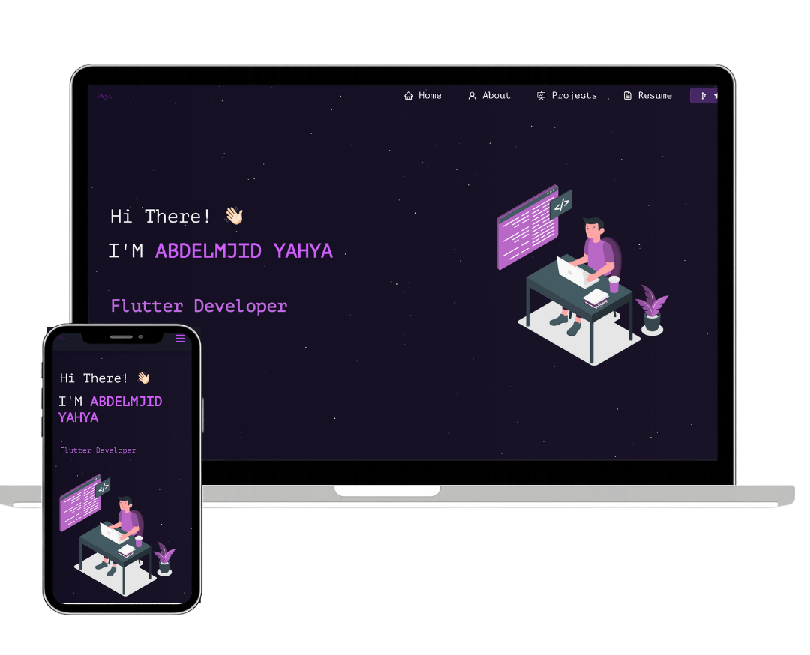

<h2 align="center">
  Abdelmajid Yahya - Portfolio 
  <a href="https://github.com/abdelmajid152" target="_blank">github.com/abdelmajid152</a>
</h2>
 

  
  

 

 &nbsp;
 &nbsp;

---

### 👋 Hi, I'm Abdelmjid Yahya
**Flutter Developer | Software Development | Building real-world apps with clean architecture**

This is my personal portfolio website, where I showcase my projects and technical skills.

## � Projects

- **Shtgool Mobile Quiz Game**: Cross-platform quiz application with 25,000+ downloads.
- **Aqarak Real Estate App**: Mobile app for property search and listing.
- **WhatsApp Status Saver**: Utility app for saving WhatsApp statuses.
- **Diya Alqalb**: Intuitive UI and real-time data integration app.

## 🛠 Built With

- **React.js**
- **React-Bootstrap**
- **CSS3**
- **React PDF Renderer** (for CV preview)

## 📱 Features

- **📖 Multi-Page Layout**
- **🎨 Modern Dark Theme**
- **📱 Fully Responsive**
- **📄 Live CV Preview**

## 🛠 Installation and Setup

1. **Clone the repo**
2. **Install dependencies**: `npm install`
3. **Run locally**: `npm start`

---

## Credits
This project is based on the portfolio template by [Soumyajit Behera](https://github.com/soumyajit4419/Portfolio).

### Show your support
Give a ⭐ if you like this website!
